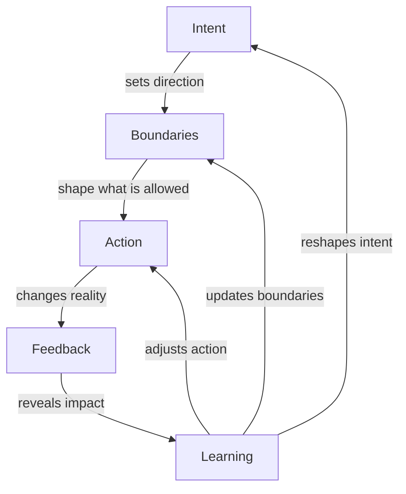

Most software was built around a quiet assumption: the important thinking happens before the system runs. Requirements are gathered, processes are drawn, controls are set, code is deployed, and then the system executes.

That model is not disappearing, but it is no longer enough. Future systems will be less like static machinery and more like listening loops. They will receive intent, test it against boundaries, act, read the feedback that comes back, and learn what should change next.

AI makes this shift obvious, but AI is not the whole story. The same move appears wherever systems must coordinate across boundaries: data-sharing networks, cloud estates, factories, logistics chains, energy systems, security operations, industrial platforms, and infrastructure that can no longer be operated as a stack of isolated tools. The system no longer sits at the end of a command. It sits between intent and reality.

The loop is simple, but it changes the character of IT. Execution is no longer the interesting part by itself. The interesting part is whether intent, boundaries, action, feedback, and learning stay connected while the system is running.

## Intent sets direction

Commands tell a system exactly what to do. Intent tells it what kind of outcome is wanted. That distinction matters because modern systems have more ways to act than people can comfortably enumerate in advance.

Intent can come from a person, a customer action, a sensor, a scheduled process, a failed workflow, a market signal, or another system. In a data space, intent may be to share maintenance data with a partner without giving up control of its use. In autonomous operations, intent may be to keep a service experience, production line, logistics path, cloud platform, or energy flow inside an agreed range instead of telling one specific device or service to restart. The system needs enough understanding to choose a path, and enough humility to know when the intent is too vague to act on.

## Boundaries shape what is allowed

Autonomy without boundaries is just speed. Future systems need to know what they may observe, which identity they are acting as, what data they may touch, what cost they may create, which changes need approval, and where the answer must be no.

These boundaries are not a bureaucratic afterthought. They are the shape of trust. A system that can plan, call tools, move money, change infrastructure, route information, or trigger physical action needs boundaries that are as explicit as its capabilities. Otherwise the clever part of the system becomes the dangerous part.

[Eclipse Dataspace Components](https://eclipse-edc.github.io/) makes that visible because the boundary is part of the product. A data space needs participants, identities, catalogs, contract negotiation, control planes, data planes, and policy-aware transfer. Who is the participant? Which catalog entry is being requested? What contract applies? What usage rule follows the data after transfer? The interesting part is not that data can move. The interesting part is that movement can be governed while the participants remain independent.

Autonomous operations have the same dependency on boundaries. Which domains can self-heal? Which changes are reversible? Which objectives matter most? When is prediction not enough? The more a system can do, the more explicitly it needs to know where action ends and review begins.

## Action is distributed

Action no longer lives in one application. It is spread across models, services, platforms, workflows, queues, data pipelines, devices, SaaS tools, partner systems, and people. A future system operates by composing those capabilities at the moment they are needed.

That makes clean interfaces more important, not less. In a data space, capability is split across connectors, catalogs, identity services, control planes, and data planes. In autonomous operations, it may be split across devices, facilities, clouds, service platforms, planning systems, safety controls, assurance tools, and customer-facing services.

Large-scale networks make that coordination problem concrete. In [TM Forum's Autonomous Networks](https://www.tmforum.org/missions/autonomous-networks), a service objective is expressed, operating domains sense drift, AI-assisted control loops optimize or heal, and the system knows when the risk is high enough to involve people. The same shape appears in platforms, factories, logistics, energy, security, and other operational systems.

The more intelligent the surrounding system becomes, the more valuable it is to have known entry points, known effects, reversible actions, and visible traces. A sophisticated system should not feel mysterious. It should be able to say what it touched, why it touched it, and what it expected to happen.

## Feedback tells the system what happened

Feedback is how reality interrupts the plan. It includes telemetry, user behavior, financial movement, operational state, physical sensors, partner responses, audit events, model confidence, operator notes, and the small signs that something is drifting away from expectation. At the sharper edge, [AlphaEvolve](https://deepmind.google/discover/blog/alphaevolve-a-gemini-powered-coding-agent-for-designing-advanced-algorithms/) shows feedback becoming selection pressure: models propose code, automated evaluators verify and score it, and the strongest results feed the next round of algorithm design.

A future system should not collect feedback only for dashboards. It should use it as memory. In a data space, memory includes who exchanged what, under which contract, and with which obligations. In autonomous operations, memory includes service health, customer experience, physical state, fault history, energy use, previous remedies, and the confidence behind a prediction. What happened? What changed? What was tried before? What made things better? What made them worse? A system that cannot remember its own actions cannot be trusted to adapt.

## Learning changes the loop

Learning is not the opposite of automation. It is what makes automation worth trusting. Some learning becomes an automatic adjustment. Some needs review. Some should change the boundaries for next time. Some should stop the system because the intent, feedback, or risk no longer makes sense.

In a data space, learning may change a contract, deny a transfer, narrow a policy, or show that a partner relationship needs a different level of trust. In autonomous operations, learning may approve a risky optimization, roll back a self-healing action, change the operating objective, or redraw the line between automatic operation and human review.

The future is not fully autonomous IT, and it is not a return to manual control. It is systems that can act, remember, explain, and adapt inside visible boundaries. The cleverness is not that no one is steering. The cleverness is that steering becomes visible: what was intended, what was allowed, what happened, what was learned, and what should change next.
